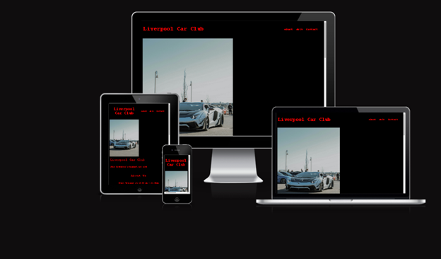
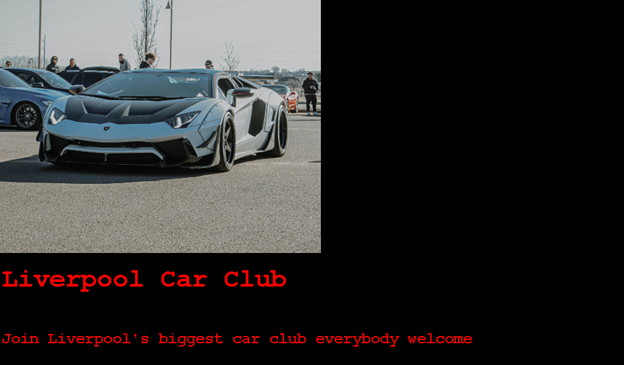
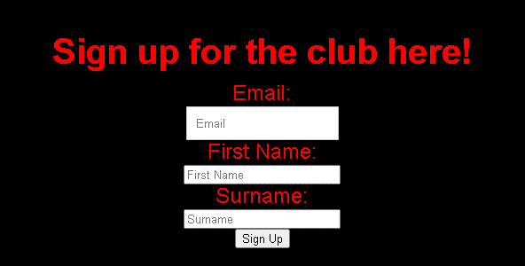
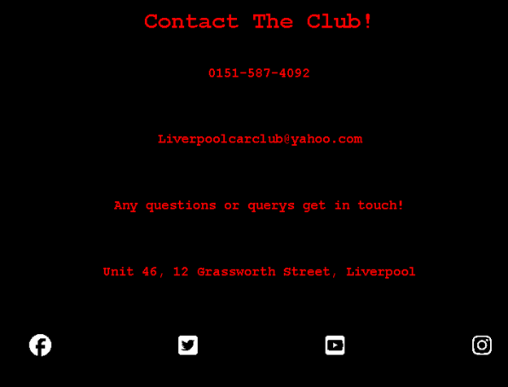
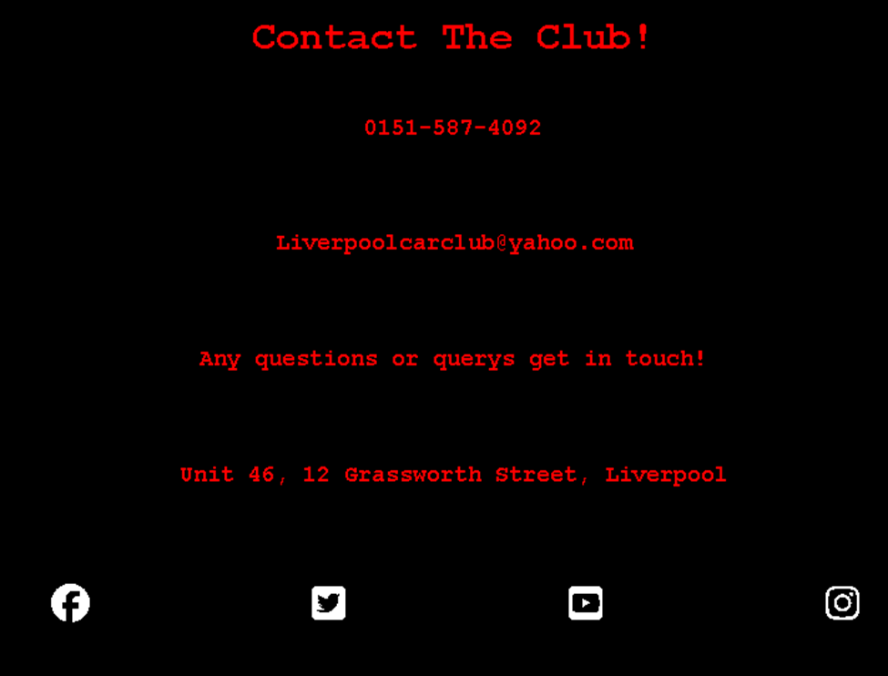

# Liverpool Car Club

The Liverpool car club website is a page for people of all ages and gender no matter the age either looking for another fun place to connect with other petrolheads and discuss and show off their pride and joy.

Visitors of this website will find all the info they need to know about the location and getting themselves signed up so they can attend the next upcoming vehicle meet.

## Features
**Navigation**
   + Featured at the top of the page is the navigation bar it shows the club name in the left corner :Liverpool Car Club
   + The other navigation links are to the right About, Join and Contact which link to the relevant areas of the page.
   + The text in the navigation can easily be read due to the red font and the black background.

   .

**The Header**
   + The header displays the name of the club in the red font used throughout the page.
   + The header encourages people to join.
   + This section provies the user with clear information about what and who the site is for.

   

**About us section**
   + The about us section gives the user details about what time they can expect the club to start and the type of people that attend. It also states what the club has to offer.

**The Sign Up Form**
   + The sign up section provides a form whre the user can enter their details to sign up to attend the club.
   + The form collects details such as Email address first name and surname.
   + The sign up form is essential to the user being able to attend the club so is valuble to the user.
   

**The contact section**
   + The contact section provides users with everyhting they need to know to contact the club icluding phone number email address and also the address of the club itself.
   + The contact section also includes social media icons which can be clicked to find the club on the respective social media platforms.

## Testing
* I have tested the page works on browsers: Chrome and Safari.
* The project is responsive and looks good on standard screen sizes.
* I confirmed that all of the text in the webpage is readable and easy to understand.
* I confirmed that the sign up form works requires an input in every field, will only accept an email within the email field and also the submit button works.

**Validator testing**
* HTML
  + No errors returned when passing through the official W3C validator.
* CSS
   + No errors returned when passing through the official W3C validator.

* Accessibility
   + I confirmed that my chosen fonts and colors are easy to read and understand by running it through lighthouse in devtools.
   

**Unfixed bugs**
- No unfixed bugs

**Deployment**
* The site was deployed to Github pages. The steps to deploy are:
   + Open Github repository, click settings tab.
   + click pages, make sure branch is set to main and save it.
   + Once saved click code back to your home page and halfway down the web page deployments will be on the right click link to navigate to completed website.

   [Liverpool Car Club](https://lfcdavids.github.io/LPL-CAR-CLUB-MAIN-MAIN/)

   **Credits**
+ The code to make the social media links was taken from the Code Institute [Love Running](https://lfcdavids.github.io/Love-Running/) Project.

**Media** 
+ The image in the header was taken from [Pexels](https://www.pexels.com/)

