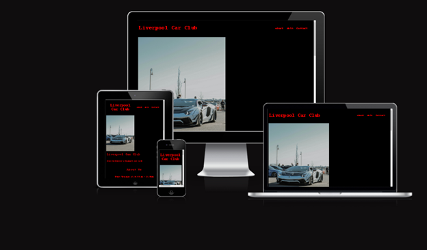
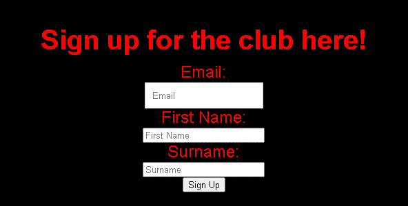

**#Liverpool Car Club**
The Liverpool car club website is a page for people of all ages and gender no matter the age either looking for another fun place to connect with other petrolheads and discuss and show off their pride and joy.

Visitors of this website will find all the info they need to know about the location and getting themselves signed up so they can attend the next upcoming vehicle meet.

.

#Features
* Navigation
   + Featured at the top of the page is the navigation bar it shows the club name in the left corner :Liverpool Car Club
   + The other navigation links are to the right About, Join and Contact which link to the relevant areas of the page.
   + The text in the navigation can easily be read due to the red font and the black background.
   .

* The Header
   + The header displays the name of the club in the red font used throughout the page.
   + The header encourages people to join.
   + This section provies the user with clear information about what and who the site is for.
   

* About us section 
   + The about us section gives the user details about what time they can expect the club to start and the type of people that attend. It also states what the club has to offer.

* The Sign Up Form
   + The sign up section provides a form whre the user can enter their details to sign up to attend the club.
   + The form collects details such as Email address first name and surname.
   + The sign up form is essential to the user being able to attend the club so is valuble to the user.
   
    